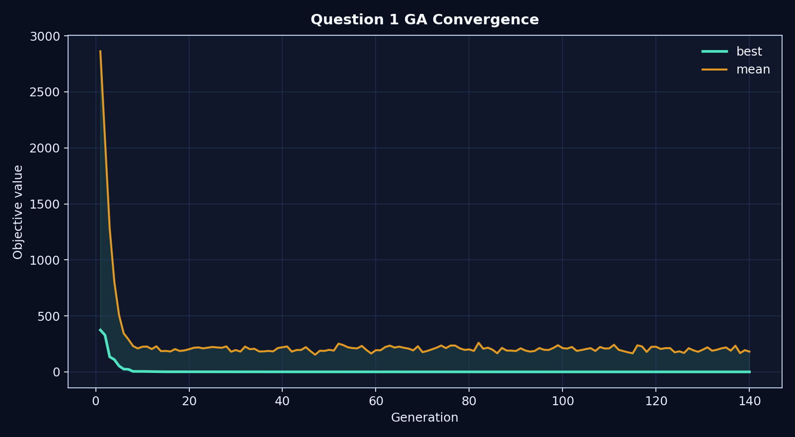
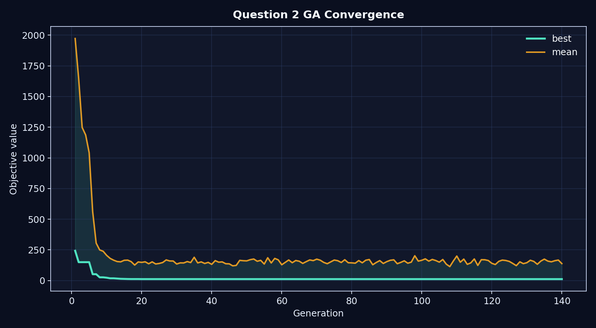
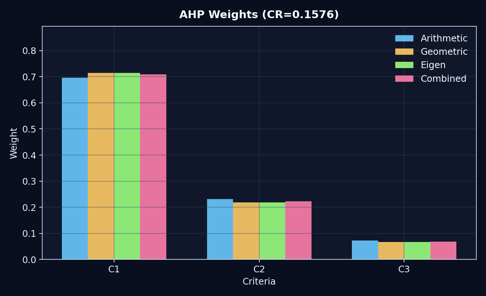
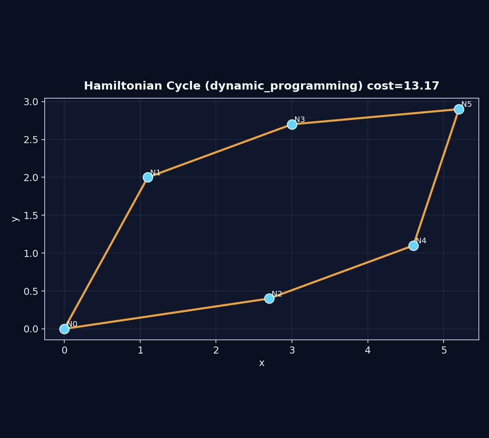

# 华数杯算法展示工程

<p align="center">
  
</p>

<p align="center">
  <strong>遗传优化 + 层次分析 + 蚁群路径规划 + 哈密尔顿圆环</strong>
</p>

<p align="center">
  
  
  
  
</p>

## 论文与成果一键跳转

### 论文直达

- 主论文: [1-paper/机器臂关节角路径的多目标优化设计.pdf](1-paper/%E6%9C%BA%E5%99%A8%E8%87%82%E5%85%B3%E8%8A%82%E8%A7%92%E8%B7%AF%E5%BE%84%E7%9A%84%E5%A4%9A%E7%9B%AE%E6%A0%87%E4%BC%98%E5%8C%96%E8%AE%BE%E8%AE%A1.pdf)
- 题面与附件: [1-paper/A题/2024年A题  机械臂关节角路径的优化设计.pdf](1-paper/A%E9%A2%98/2024%E5%B9%B4A%E9%A2%98%20%20%E6%9C%BA%E6%A2%B0%E8%87%82%E5%85%B3%E8%8A%82%E8%A7%92%E8%B7%AF%E5%BE%84%E7%9A%84%E4%BC%98%E5%8C%96%E8%AE%BE%E8%AE%A1.pdf)
- 原始数据: [1-paper/A题/附件.xlsx](1-paper/A%E9%A2%98/%E9%99%84%E4%BB%B6.xlsx)

### 结果直达

- 封面动图: [assets/gifs/github_cover.gif](assets/gifs/github_cover.gif)
- ACO 动图: [assets/gifs/aco_path.gif](assets/gifs/aco_path.gif)
- GA 动图: [assets/gifs/ga_evolution.gif](assets/gifs/ga_evolution.gif)
- 指标汇总: [docs/results/showcase_metrics.md](docs/results/showcase_metrics.md)

### 模块代码直达

- 机械臂优化: [src/huashu_showcase/robotics](src/huashu_showcase/robotics)
- 层次分析 AHP: [src/huashu_showcase/ahp](src/huashu_showcase/ahp)
- 哈密尔顿圆环: [src/huashu_showcase/graph](src/huashu_showcase/graph)
- 蚁群路径规划: [src/huashu_showcase/path_planning](src/huashu_showcase/path_planning)
- 可视化引擎: [src/huashu_showcase/visualization](src/huashu_showcase/visualization)
- 构建脚本: [scripts](scripts)

## 不跑代码也能看懂成果

| 模块 | 预览 |
|---|---|
| 封面动态总览 |  |
| ACO 路径扩展 |  |
| Q1 收敛曲线 |  |
| Q2 收敛曲线 |  |
| AHP 权重 |  |
| 哈密尔顿圆环 |  |

核心结果摘要见: [docs/results/showcase_metrics.md](docs/results/showcase_metrics.md)

## 快速构建

### 1) 安装依赖

```bash
pip install -r requirements.txt
```

### 2) 一键生成全部图像与 GIF

```bash
python scripts/build_showcase.py
```

自动更新以下内容:

- assets/gifs/github_cover.gif
- assets/gifs/ga_evolution.gif
- assets/gifs/aco_path.gif
- assets/figures/*.png
- docs/results/showcase_metrics.md

### 3) 只刷新首页封面 GIF

```bash
python scripts/build_cover.py
```

## 工程结构

```text
.
├─1-paper/                      # 论文、题面、附件
├─2-code/                       # 历史原始脚本（保留）
├─assets/
│  ├─gifs/                      # 动态展示资源
│  └─figures/                   # 静态结果图
├─docs/
│  ├─architecture/              # 架构文档
│  ├─algorithms/                # 算法说明
│  └─results/                   # 自动结果汇总
├─scripts/                      # 一键构建脚本
└─src/huashu_showcase/
   ├─robotics/                  # 第一问/第二问
   ├─ahp/                       # 层次分析
   ├─graph/                     # 哈密尔顿圆环
   ├─path_planning/             # 蚁群路径规划
   └─visualization/             # 图像和动图导出
```

## 重构价值

- 算法模块化: 计算逻辑、优化逻辑、可视化逻辑彻底分离。
- 可视化升级: 首页封面由多算法动态拼接构成，第一眼即可体现工作量和结果质量。
- 文档完善: 各子目录均配置 README，便于评审快速定位论文、代码与结果。
- 复现友好: 提供 build 脚本，一条命令即可重建全部展示资产。
